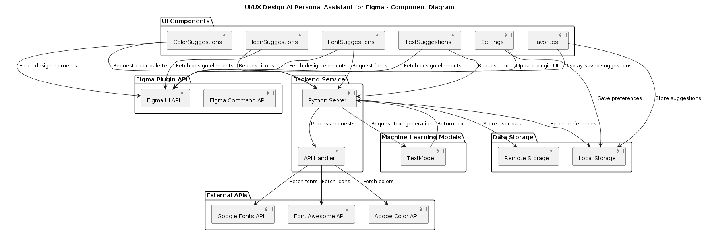

# Nova UI/UX Design AI Assistant & Plugin


## Overview

The **UI/UX Design AI Personal Assistant** is a Figma plugin designed to assist UI/UX designers with generating color palettes, suggesting icons, recommending fonts, and providing text suggestions seamlessly within the Figma environment. This plugin integrates with external APIs and utilizes machine learning models for enhanced design suggestions.

### Features

- **Color Palette Suggestions**: Generates harmonious color palettes using the Adobe Color API.
- **Icon Suggestions**: Provides a wide range of icon suggestions using the Font Awesome API.
- **Font Recommendations**: Suggests suitable fonts from the Google Fonts API for your designs.
- **Text Suggestions**: Offers context-aware text suggestions using a pre-trained model from Hugging Face.

## Folder Structure

```plaintext
NovaAI/
├── frontend/
│   ├── src/
│   │   ├── components/
│   │   ├── styles/
│   │   ├── index.js
│   │   ├── plugin.js
│   │   └── manifest.json
│   ├── build/
│   ├── public/
│   ├── package.json
│   ├── package-lock.json
│   └── node_modules/
├── backend/
│   ├── src/
│   │   ├── app.py
│   │   ├── config.py
│   │   ├── api_handler.py
│   │   ├── models/
│   │   │   ├── text_model.py
│   │   │   └── __init__.py
│   │   ├── static/
│   │   ├── templates/
│   │   ├── requirements.txt
│   │   └── __init__.py
│   ├── data/
│   │   ├── local_storage/
│   │   └── remote_storage/
│   ├── tests/
│   │   ├── test_app.py
│   │   └── test_api_handler.py
│   ├── Dockerfile
│   └── README.md
├── docs/
│   ├── api_docs.md
│   ├── plugin_docs.md
│   ├── uml_diagrams/
│   │   ├── component_diagram.puml
│   │   └── component_diagram.png
│   └── README.md
└── README.md
```

## Workflow




## Installation and Setup

### Prerequisites

- Node.js (for frontend development)
- Python 3.x (for backend development)

### Frontend Setup

1. Clone the repository:

   ```bash
   git clone https://github.com/msnabiel/NovaAI.git
   cd NovaAI/frontend
   ```

2. Install dependencies:

   ```bash
   npm install
   ```

3. Build the plugin:

   ```bash
   npm run build
   ```

4. The compiled plugin will be located in the `frontend/build` directory.

### Backend Setup

1. Navigate to the backend directory:

   ```bash
   cd ../backend
   ```

2. Set up a virtual environment (optional but recommended):

   ```bash
   python3 -m venv venv
   source venv/bin/activate  # On Windows, use `venv\Scripts\activate`
   ```

3. Install Python dependencies:

   ```bash
   pip install -r requirements.txt
   ```

4. Run the backend server:

   ```bash
   python src/app.py
   ```

## Usage

1. Open Figma and create/open a project.
2. Navigate to the Plugins menu.
3. Select "UI/UX Design AI Personal Assistant" from the list.
4. Use the plugin features to generate color palettes, icons, fonts, and text suggestions directly in your Figma design.

## Documentation

- Detailed API documentation can be found in `docs/api_docs.md`.
- Plugin usage and setup instructions are available in `docs/plugin_docs.md`.
- UML diagrams illustrating the system architecture can be found in `docs/uml_diagrams/`.

## Contributing

Contributions are welcome! Please fork the repository and submit pull requests to contribute new features, improve documentation, or fix issues.

## License

This project is licensed under the [MIT License](LICENSE).

## Contact

For questions or support, please contact [Syed Nabiel Hasaan M](mailto:msyednabiel@gmail.com).
